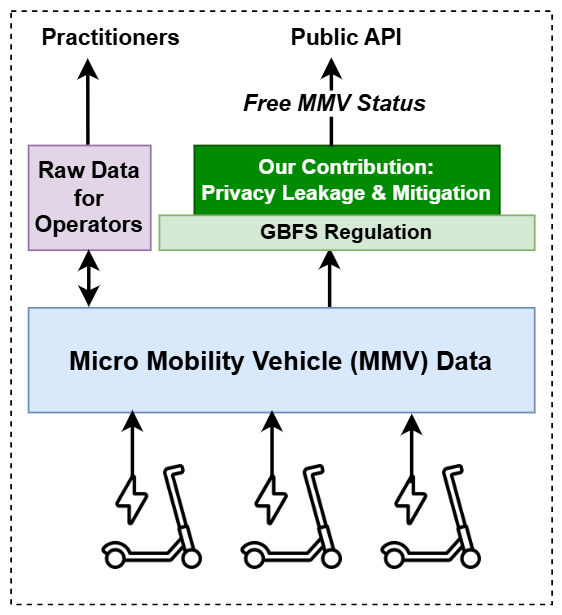

# Precision Leads Recalling You! Improved Location Privacy for Shared Mobility Services

<p align="center">
  
  <br>
  <em>Figure 1: A typical data sharing pipeline.</em>
</p>


The rapid growth of shared micromobility, such as e-scooters and e-bikes, has transformed urban transportation, bridging the gap between public transit and first/last-mile mobility. As users and cities need information on the status and usage of such micromobility vehicles, operators publish the data using General Bikeshare Feed Specification (GBFS)-compliant APIs. These feeds are extremely useful for operational transparency and enabling third-party integration into navigation apps. However, it has raised significant privacy concerns, particularly around the fine-grained spatiotemporal data sharing, which can reveal potentially  sensitive information about travel patterns, even without explicit personal identifiers. For instance, by leveraging high-precision GPS coordinates, battery levels, and timestamps, malicious actors can infer trip origins and destinations, posing a risk of membership inference attacks. Despite efforts to mitigate such risks through dynamic vehicle IDs and GBFS guidelines, the potential for privacy leakage remains. In this paper, we investigate these privacy risks in the context of micromobility data, addressing four key research questions: (1) identifying vulnerable fields in GBFS data that can leak trip trajectories; (2) validating trip inference attacks without access to ground truth data from operators; (3) assessing the generalizability of such attacks across different cities, operators and GBFS version; and (4) proposing effective mitigation strategies. We propose a heuristic method for reconstructing trip origins and destinations using only publicly available GBFS data, without relying on vehicle identifiers or auxiliary quasi-identifiers. Our empirical analysis, conducted on data from two cities with varying sizes, shows that a significant proportion of trips can be accurately recalled, with over 80% of trip source and destination pairs identified across both cities. Furthermore, our proposed anonymization techniques, such as datageneralization and removal of quasi-identifiers, can prevent up to 97% of successful attacks, ensuring privacy without sacrificing data utility.

## Read the full paper

paper/PoPETs_preprint_2026_3.pdf

## Command to run the system

```
cd codebase
```

### Collect data using API
```
python data_collector.py
```
### Preprocess JSON files to CSV
```
python preprocessor.py
```
### Inference of MicroMobility Vehicle (MMV) Status
```
python status_inference.py --input_dir sample_data --output_dir status_output
```
### Threat model
```
```
### Mitigation techniques
```
python coarsening.py
python api_limiting.py
python k_anonymity.py --input_dir sample_data --output_dir anonymized_data --k 3
```

# References

If you use the repository or refer the paper in one of your projects, please cite the paper below:

```
@article{das2026precision,
  title={Precision Leads Recalling You! Improved Location Privacy for Shared Mobility Services},
  author={Debasree Das and Daniela Nicklas},
  journal={Proceedings on Privacy Enhancing Technologies},
  year={2026}
}
```
